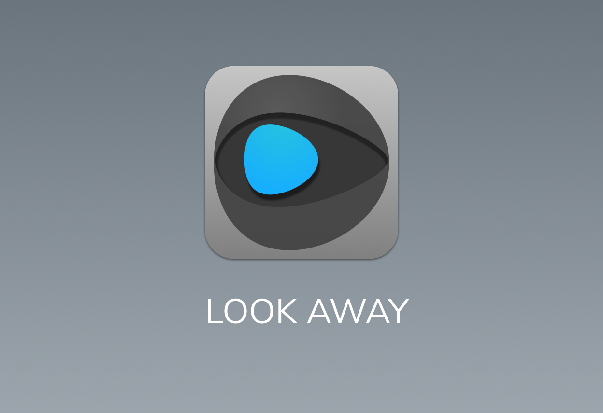
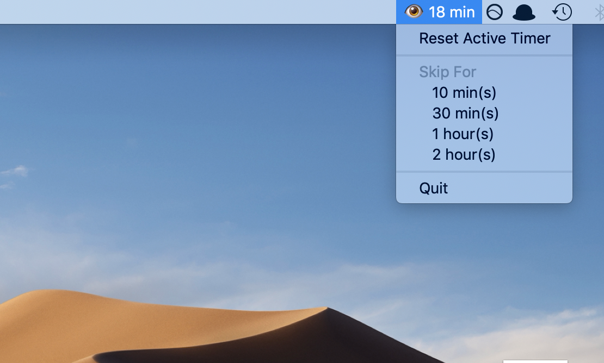
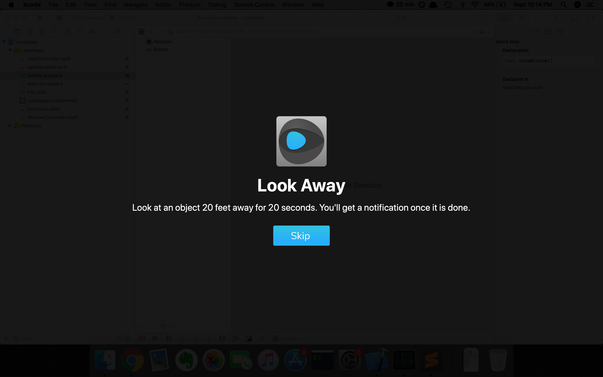

	 
	 
	
	 
	 

This is a minimalistic Mac app which helps you enforce the [20-20-20 rule](https://www.aao.org/eye-health/tips-prevention/computer-usage), i.e. every 20 minutes, take a 20 second break to look at something 20 feet away. These breaks help preserve the eyes from strain, dryness, fatigue and other ill effects of the [Computer Vision Syndrome (CVS)](https://www.aoa.org/patients-and-public/caring-for-your-vision/protecting-your-vision/computer-vision-syndrome).

## Installation
- [Download](example.com) the App.
- Add it to your [startup items](https://www.lifewire.com/how-to-add-startup-items-to-mac-2260903) so that it launches automatically on startup

## Usage
The app adds a 20 minute timer to your menubar.  

  
Once 20 minutes are over, it overlays the screen for 20 seconds asking you to Look Away. Thats it!
  

## Build Requirements
- Swift 5+
- XCode 10+
- macOS 10.14+
